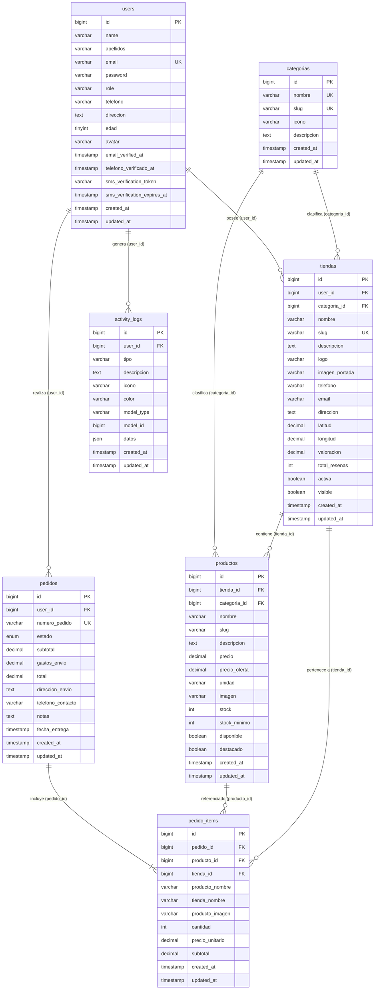
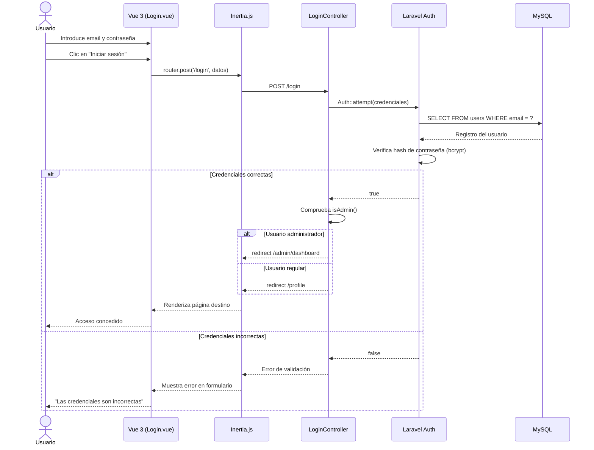
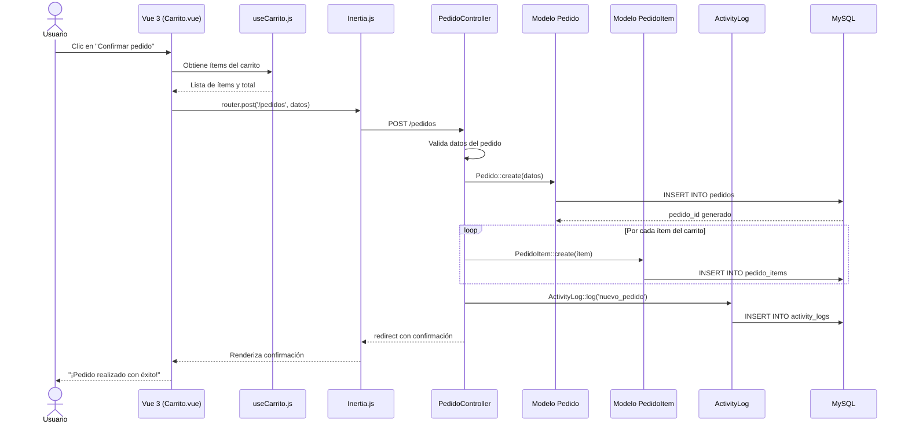
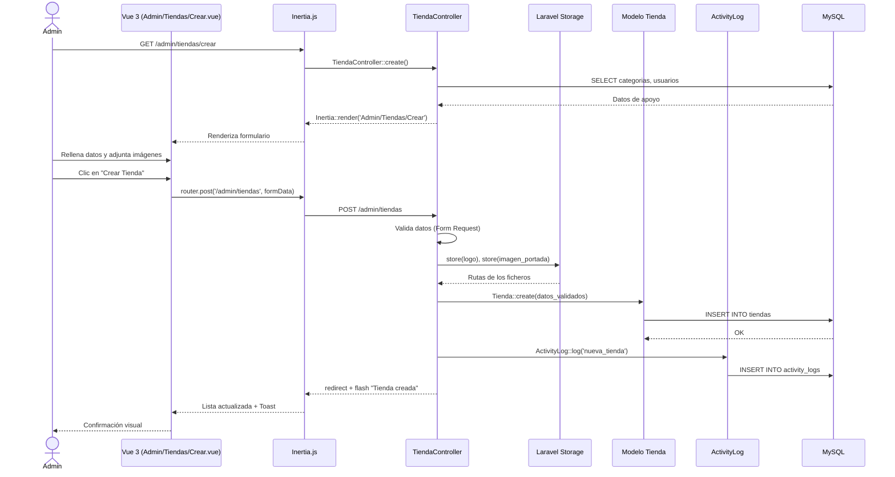
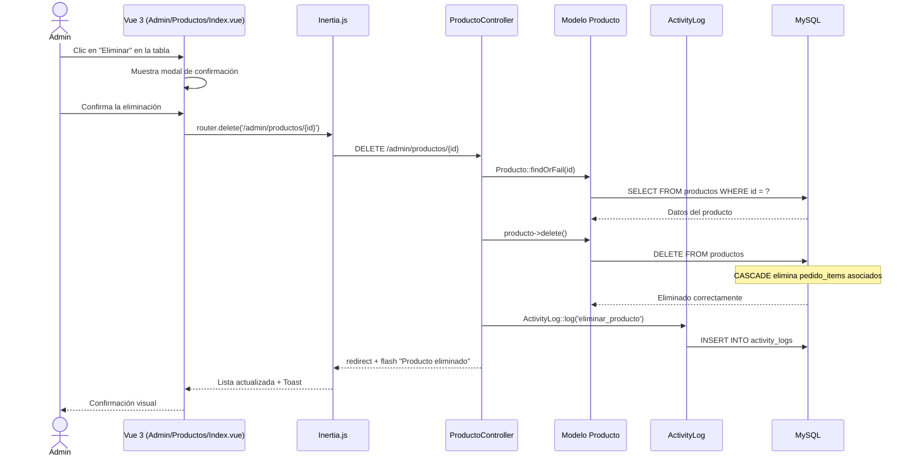
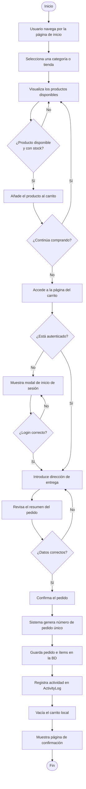
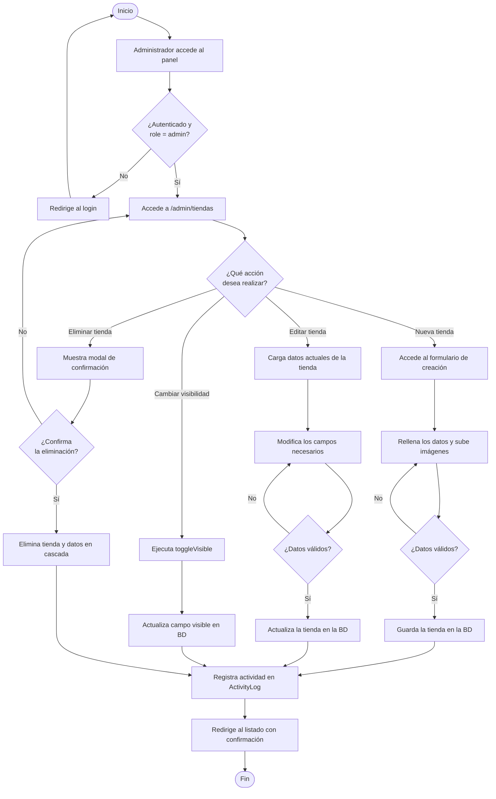
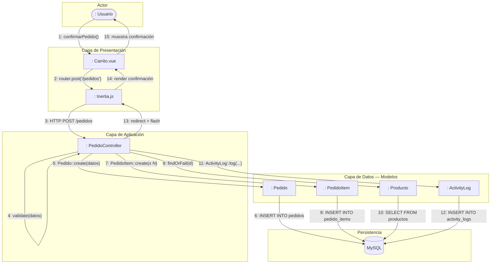

# 7. Diseño

## Índice

- [7 Diseño](#7-diseño)
  - [7.1 Arquitectura Cliente-Servidor](#71-arquitectura-cliente-servidor)
  - [7.2 Arquitectura de Tres Niveles](#72-arquitectura-de-tres-niveles)
    - [7.2.1 Capa de Presentación](#721-capa-de-presentación)
    - [7.2.2 Capa de Aplicación](#722-capa-de-aplicación)
    - [7.2.3 Capa de Datos](#723-capa-de-datos)
  - [7.3 Patrón MVC](#73-patrón-mvc)
  - [7.4 Frameworks](#74-frameworks)
  - [7.5 Esquema del Sistema](#75-esquema-del-sistema)
    - [7.5.1 Diagrama de Clases UML](#751-diagrama-de-clases-uml)
    - [7.5.2 Modelo Relacional de la Base de Datos](#752-modelo-relacional-de-la-base-de-datos)
  - [7.6 Descripción de la Interacción de Objetos](#76-descripción-de-la-interacción-de-objetos)
    - [7.6.1 Diagramas de Secuencia](#761-diagramas-de-secuencia)
    - [7.6.2 Diagramas de Actividades](#762-diagramas-de-actividades)
    - [7.6.3 Diagramas de Colaboración](#763-diagramas-de-colaboración)
  - [7.7 Jerarquía de Privilegios (Roles)](#77-jerarquía-de-privilegios-roles)
  - [7.8 Diseño de la Interfaz de Usuario](#78-diseño-de-la-interfaz-de-usuario)
    - [7.8.1 Esquema de la Interfaz](#781-esquema-de-la-interfaz)
    - [7.8.2 Storyboards (Prototipado de la IU)](#782-storyboards-prototipado-de-la-iu)
    - [7.8.3 Optimización de la Interfaz](#783-optimización-de-la-interfaz)

---

El diseño del software se encuentra en el núcleo técnico de la ingeniería del software. Una vez que se han analizado los requisitos de **Rustikan**, el diseño, la generación de código y las pruebas son las tres actividades técnicas siguientes. Cada actividad transforma la información de manera que dé lugar, en última instancia, a un software validado.

En general, la actividad del diseño se refiere al establecimiento de las estructuras de datos, la arquitectura general del software, las representaciones de la interfaz y de los algoritmos. Por tanto, el diseño debe contemplar todos los requisitos explícitos obtenidos en la fase de análisis, y debe ser una guía que puedan leer y entender tanto los que construyen el código como los que prueban y mantienen el software.

---

## 7.1 Arquitectura Cliente-Servidor

La arquitectura Cliente-Servidor es un modelo para el desarrollo de sistemas de información en el que las transacciones se dividen en procesos independientes que cooperan entre sí para intercambiar información, servicios o recursos. Se denomina **cliente** al proceso que inicia el diálogo o solicita los recursos, y **servidor** al proceso que responde a las solicitudes. Ambas partes deben estar conectadas entre sí mediante una red de comunicación. Este modelo de interacción es el más común entre aplicaciones en red.

Este tipo de arquitectura es la más utilizada en la actualidad, debido a que es la que mejor ha evolucionado en los últimos años. Para su correcto funcionamiento, se requieren tres tipos de software:

- **Software de gestión de datos.** Alojado en el servidor, se encarga de la manipulación y gestión de los datos almacenados. En **Rustikan**, este rol lo desempeña el servidor de bases de datos **MySQL**, gestionado mediante el ORM **Eloquent** de Laravel.
- **Software de desarrollo.** Se aloja en los equipos dedicados al desarrollo de la aplicación.
- **Software de interacción con los usuarios.** Reside en el cliente y constituye la interfaz gráfica de usuario. En **Rustikan**, este rol corresponde a la aplicación **Vue 3** ejecutada en el navegador web del usuario.

La separación entre cliente y servidor en **Rustikan** es de tipo lógico. El cliente es el **navegador web** del usuario, que ejecuta la interfaz construida con **Vue 3** e **Inertia.js**. El servidor está compuesto por:

- **Servidor web:** Apache gestionado mediante Laragon en el entorno de desarrollo.
- **Servidor de aplicaciones:** PHP 8.3 con el framework **Laravel 11**, que contiene toda la lógica de negocio.
- **Servidor de bases de datos:** MySQL 8, que almacena toda la información del sistema.

Los clientes de **Rustikan** realizan las siguientes funciones a través del navegador web:

- Navegar y buscar tiendas locales de Lanzarote, filtrar por categoría y localizarlas en el mapa interactivo.
- Visualizar el catálogo de productos de cada tienda y añadirlos al carrito de compra.
- Realizar pedidos e introducir datos de entrega.
- Gestionar el perfil de usuario (datos personales, avatar, contraseña).
- Acceder al panel de administración (exclusivamente para usuarios con rol `admin`).

El servidor de **Rustikan** lleva a cabo las siguientes funciones:

- Autenticación y autorización de usuarios mediante el sistema de sesiones de Laravel.
- Procesamiento de la lógica de negocio: creación de pedidos, gestión de tiendas y productos, control de stock, registro de actividad.
- Acceso, almacenamiento y recuperación de datos desde la base de datos MySQL.
- Gestión del almacenamiento de ficheros (imágenes de tiendas y productos) mediante Laravel Storage.
- Control de accesos concurrentes a la base de datos y protección contra ataques mediante middleware.

Entre las principales características de esta arquitectura en **Rustikan** pueden destacarse las siguientes:

- El servidor presenta a todos sus clientes una interfaz única a través de las respuestas gestionadas por **Inertia.js**.
- El cliente no necesita conocer la lógica interna del servidor, únicamente la interfaz de componentes Vue expuesta por Inertia.
- El cliente no depende de la ubicación física del servidor, accediendo exclusivamente mediante URLs HTTP/HTTPS.
- Los cambios en el servidor implican pocos o ningún cambio en el equipo del cliente, gracias al desacoplamiento que ofrece Inertia.js.

---

## 7.2 Arquitectura de Tres Niveles

La arquitectura de tres niveles se centra en la definición de responsabilidades entre las diferentes partes de la aplicación **Rustikan**. Pueden distinguirse los siguientes niveles:

### 7.2.1 Capa de Presentación

El nivel de presentación representa la interfaz de usuario, a través de la cual se interactúa con la aplicación. Su función principal es traducir la información en un formato comprensible e interactivo para el usuario. Esta capa presenta el sistema al usuario, le comunica la información y también la captura para transmitirla a la capa de aplicación.

En **Rustikan**, la capa de presentación está compuesta por las siguientes tecnologías:

- **Vue 3** con Composition API (`<script setup>`): framework JavaScript que gestiona toda la interfaz de usuario de forma reactiva.
- **Inertia.js**: actúa como puente entre el servidor Laravel y el cliente Vue, permitiendo una experiencia de Single Page Application (SPA) sin necesidad de una API REST independiente.
- **Tailwind CSS**: framework de estilos de tipo *utility-first* que proporciona un diseño minimalista, *responsive* y accesible.
- **Vite**: herramienta de construcción y servidor de desarrollo que compila y optimiza los recursos estáticos (JavaScript y CSS).

Las páginas principales de la aplicación, organizadas en `resources/js/Pages/`, son las siguientes:

| Ruta | Componente Vue | Descripción |
|:---|:---|:---|
| `/` | `Inicio.vue` | Página principal con mapa interactivo y listado de tiendas |
| `/tienda/:slug` | `TiendaDetalle.vue` | Detalle de tienda con su catálogo de productos |
| `/carrito` | `Carrito.vue` | Carrito de compra con resumen y confirmación |
| `/admin/dashboard` | `Admin/Panel.vue` | Panel de administración con estadísticas |
| `/login`, `/register` | `Auth/*` | Autenticación y registro de usuarios |
| `/profile` | `Profile/*` | Gestión del perfil del usuario autenticado |

### 7.2.2 Capa de Aplicación

Esta capa coordina la aplicación, procesa las peticiones HTTP, aplica la lógica de negocio y actúa de intermediario entre la capa de presentación y la capa de datos. Se reciben peticiones del usuario y se envían respuestas tras el proceso. Se denomina capa de negocio porque es aquí donde se establecen todas las reglas que deben cumplirse.

En **Rustikan**, la capa de aplicación está compuesta por los siguientes elementos:

- **Laravel 11**: framework PHP que implementa el enrutamiento, la lógica de negocio y la gestión de peticiones HTTP.
- **Controladores** (`app/Http/Controllers/`): procesan las peticiones y devuelven respuestas Inertia al cliente. Se dividen en dos grupos:
  - Controladores públicos: `CategoriaController`, `ProfileController`.
  - Controladores de administración (`Admin/`): `DashboardController`, `TiendaController`, `ProductoController`, `PedidoController`, `UsuarioController`, `IngresoController`.
- **Middleware**: protección de rutas mediante los filtros `auth` (autenticación) y `admin` (verificación de rol) aplicados sobre todas las rutas del panel de administración.
- **Form Requests** (`app/Http/Requests/`): validación centralizada y declarativa de los datos de entrada.
- **Enrutador** (`routes/web.php`): dirige cada petición HTTP al controlador correspondiente.

### 7.2.3 Capa de Datos

En este nivel la información se almacena y se recupera del sistema gestor de bases de datos. La información se procesa en la capa de negocio y finalmente retorna al usuario. La capa de datos es donde residen los datos persistentes del sistema.

En **Rustikan**, la capa de datos está compuesta por los siguientes elementos:

- **MySQL 8**: sistema gestor de bases de datos relacional que almacena toda la información del sistema en siete tablas principales.
- **Eloquent ORM**: mapeador objeto-relacional de Laravel que abstrae las consultas SQL mediante clases PHP denominadas Modelos. Los modelos de **Rustikan** son: `User`, `Tienda`, `Producto`, `Pedido`, `PedidoItem`, `Categoria` y `ActivityLog`.
- **Migraciones** (`database/migrations/`): sistema de control de versiones del esquema de la base de datos, que permite recrear y modificar la estructura de manera controlada.
- **Seeders** (`database/seeders/`): clases que pueblan la base de datos con datos iniciales para los entornos de desarrollo y pruebas.

---

## 7.3 Patrón MVC

**Rustikan** utiliza el patrón **Modelo - Vista - Controlador (MVC)** para el diseño de su arquitectura, implementado a través del framework **Laravel 11** en el servidor y **Vue 3** con **Inertia.js** en el cliente.

Los tres componentes del patrón se corresponden, en **Rustikan**, con los siguientes elementos:

- **Modelo:** Los modelos Eloquent (`User`, `Tienda`, `Producto`, `Pedido`, `PedidoItem`, `Categoria`, `ActivityLog`) representan la lógica de negocio y la estructura de datos. Encapsulan las reglas de negocio mediante métodos propios (`inStock()`, `isAdmin()`, `generateOrderNumber()`, `isLowStock()`), las relaciones entre entidades y las consultas a la base de datos MySQL.

- **Vista:** Los componentes Vue 3 ubicados en `resources/js/Pages/` y `resources/js/Components/` constituyen la capa de presentación visual. Reciben los datos desde el controlador a través de Inertia.js como *props* reactivas y renderizan la interfaz de usuario en el navegador. Esta es una variante del MVC clásico: la vista reside y se ejecuta en el cliente.

- **Controlador:** Los controladores Laravel reciben las peticiones HTTP, invocan las operaciones correspondientes en los modelos y envían los datos necesarios a la vista mediante `Inertia::render()`. Por ejemplo, `TiendaController::index()` obtiene las tiendas paginadas con sus relaciones y las pasa a `Admin/Tiendas/Index.vue`.

La adaptación de MVC que ofrece **Inertia.js** mantiene la filosofía del patrón: el controlador actúa de director de orquesta, el modelo gestiona los datos y la vista los presenta, con la particularidad de que la vista es una SPA renderizada en el navegador. Esto evita la doble implementación típica de arquitecturas API REST + frontend desacoplado, simplificando el desarrollo y el mantenimiento del sistema.

---

## 7.4 Frameworks

Los frameworks de desarrollo proporcionan una estructura o marco de trabajo sobre el que se desarrollan los proyectos. Entregan una serie de bibliotecas de funciones que, junto a convenciones comunes organizadas sobre una estructura definida, permiten acelerar el desarrollo y facilitar el mantenimiento.

Entre las ventajas de utilizar frameworks pueden destacarse las siguientes:

- Facilidad para integrar a nuevos desarrolladores al proyecto, ya que se comparten convenciones de desarrollo comunes.
- No es necesario preocuparse de mantener actualizadas muchas de las funcionalidades del sistema de información.
- Se evita reinventar la rueda, aprovechando los componentes existentes con la finalidad de ahorrar tiempo de desarrollo.

Entre los inconvenientes del uso de frameworks pueden citarse los siguientes:

- Una aplicación desarrollada con un framework agrega código adicional que no ha sido escrito desde cero por el equipo de desarrollo.
- Es necesario invertir inicialmente tiempo para aprender a utilizar el framework y sus convenciones.
- En algunos casos, una aplicación desarrollada con un framework puede tener un rendimiento inicial inferior en comparación con una diseñada íntegramente desde cero.

En **Rustikan** se han utilizado los siguientes frameworks y tecnologías principales:

### Laravel 11

**Laravel** es el framework PHP de referencia para el desarrollo de aplicaciones web del lado del servidor. Proporciona un enrutador, ORM (Eloquent), sistema de migraciones, autenticación integrada, protección CSRF, sistema de colas, eventos y numerosas utilidades de desarrollo.

| Atributo | Detalle |
|:---|:---|
| Versión utilizada | Laravel 11.x |
| Lenguaje | PHP 8.3 |
| Ventajas | ORM potente, arquitectura MVC clara, documentación extensa, comunidad activa, seguridad integrada. |
| Inconvenientes | Curva de aprendizaje inicial; sobrecarga de código generado de forma automática. |

### Vue 3

**Vue.js** es un framework JavaScript progresivo para la construcción de interfaces de usuario reactivas. Se utiliza con la **Composition API** (`<script setup>`) para un código más limpio, mantenible y organizado.

| Atributo | Detalle |
|:---|:---|
| Versión utilizada | Vue 3.x (Composition API) |
| Lenguaje | JavaScript (ES2022+) |
| Ventajas | Reactividad eficiente, componentes reutilizables, excelente integración con Inertia, bajo peso. |
| Inconvenientes | Requiere conocimiento previo de JavaScript moderno y conceptos de reactividad. |

### Inertia.js

**Inertia.js** es el adaptador que conecta el backend Laravel con el frontend Vue 3, eliminando la necesidad de construir una API REST independiente. Permite crear aplicaciones SPA manteniendo la arquitectura de controladores de servidor clásica.

| Atributo | Detalle |
|:---|:---|
| Versión utilizada | Inertia.js 2.x |
| Ventajas | No requiere API REST, navegación SPA sin recarga de página, compartición sencilla de datos servidor→cliente. |
| Inconvenientes | Dependencia simultánea de dos frameworks (Laravel y Vue); menor flexibilidad para APIs públicas externas. |

### Tailwind CSS

**Tailwind CSS** es un framework de estilos de tipo *utility-first* que permite construir interfaces directamente en el HTML/JSX mediante clases utilitarias predefinidas, sin necesidad de escribir CSS personalizado.

| Atributo | Detalle |
|:---|:---|
| Versión utilizada | Tailwind CSS 3.x |
| Ventajas | Diseño consistente y rápido, totalmente *responsive*, eliminación automática de CSS no utilizado en producción. |
| Inconvenientes | Clases muy verbosas en el HTML; requiere configuración del fichero `tailwind.config.js`. |

### Vite

**Vite** es la herramienta de construcción y servidor de desarrollo que compila los recursos JavaScript y CSS. Ofrece *Hot Module Replacement* (HMR) para una experiencia de desarrollo ágil y compilaciones de producción optimizadas.

| Atributo | Detalle |
|:---|:---|
| Versión utilizada | Vite 6.x |
| Ventajas | Compilación extremadamente rápida, HMR en tiempo real, integración nativa con Vue y Laravel. |
| Inconvenientes | Entorno exclusivamente moderno; no compatible con navegadores muy antiguos. |

### MySQL

**MySQL** es el sistema gestor de bases de datos relacionales seleccionado para **Rustikan**. Almacena toda la información del sistema: usuarios, categorías, tiendas, productos, pedidos y registros de actividad.

| Atributo | Detalle |
|:---|:---|
| Versión utilizada | MySQL 8.x |
| Ventajas | Ampliamente probado, escalable, compatible con todos los servicios de hospedaje, buen rendimiento para aplicaciones de tamaño medio. |
| Inconvenientes | Menor flexibilidad que bases de datos NoSQL para datos no estructurados. |

---

## 7.5 Esquema del Sistema

En los siguientes apartados se ofrece una visión de la estructura global del sistema **Rustikan** mediante diagramas formales.

### 7.5.1 Diagrama de Clases UML

A continuación se presenta el diagrama de clases UML de **Rustikan**, que incluye todas las clases del modelo de dominio con sus atributos, métodos y relaciones. Este diagrama es más extendido que el de la fase de análisis, ya que incluye los métodos concretos de cada clase.

```mermaid
classDiagram
    class User {
        +bigint id
        +string name
        +string apellidos
        +string email
        +string password
        +string role
        +string telefono
        +string direccion
        +int edad
        +string avatar
        +isAdmin() bool
        +tiendas() HasMany
        +pedidos() HasMany
        +activityLogs() HasMany
    }

    class Categoria {
        +bigint id
        +string nombre
        +string slug
        +string icono
        +text descripcion
        +tiendas() HasMany
        +productos() HasMany
    }

    class Tienda {
        +bigint id
        +bigint user_id
        +bigint categoria_id
        +string nombre
        +string slug
        +text descripcion
        +string logo
        +string imagen_portada
        +string telefono
        +string email
        +text direccion
        +decimal latitud
        +decimal longitud
        +decimal valoracion
        +int total_resenas
        +bool activa
        +bool visible
        +user() BelongsTo
        +categoria() BelongsTo
        +productos() HasMany
        +scopeActiva() Builder
        +scopeVisible() Builder
    }

    class Producto {
        +bigint id
        +bigint tienda_id
        +bigint categoria_id
        +string nombre
        +string slug
        +text descripcion
        +decimal precio
        +decimal precio_oferta
        +string unidad
        +string imagen
        +int stock
        +int stock_minimo
        +bool disponible
        +bool destacado
        +inStock() bool
        +isLowStock() bool
        +tienda() BelongsTo
        +categoria() BelongsTo
        +pedidoItems() HasMany
    }

    class Pedido {
        +bigint id
        +bigint user_id
        +string numero_pedido
        +enum estado
        +decimal subtotal
        +decimal gastos_envio
        +decimal total
        +text direccion_envio
        +string telefono_contacto
        +text notas
        +datetime fecha_entrega
        +generateOrderNumber() string
        +user() BelongsTo
        +items() HasMany
        +scopeEstado() Builder
    }

    class PedidoItem {
        +bigint id
        +bigint pedido_id
        +bigint producto_id
        +bigint tienda_id
        +string producto_nombre
        +string tienda_nombre
        +string producto_imagen
        +int cantidad
        +decimal precio_unitario
        +decimal subtotal
        +pedido() BelongsTo
        +producto() BelongsTo
        +tienda() BelongsTo
    }

    class ActivityLog {
        +bigint id
        +string tipo
        +text descripcion
        +string icono
        +string color
        +bigint user_id
        +string model_type
        +bigint model_id
        +json datos
        +user() BelongsTo
        +model() MorphTo
        +log() ActivityLog
    }

    User "1" --> "0..*" Tienda : posee
    User "1" --> "0..*" Pedido : realiza
    User "1" --> "0..*" ActivityLog : genera
    Categoria "1" --> "0..*" Tienda : clasifica
    Categoria "1" --> "0..*" Producto : clasifica
    Tienda "1" --> "0..*" Producto : contiene
    Pedido "1" --> "1..*" PedidoItem : contiene
    PedidoItem "*" --> "1" Producto : referencia
    PedidoItem "*" --> "1" Tienda : pertenece a
```



### 7.5.2 Modelo Relacional de la Base de Datos

A continuación se pasa a tablas el modelo de datos de **Rustikan**. Este modelo es más técnico que el diagrama de clases porque está orientado al personal informático y tiene traducción directa al modelo físico que interpreta el SGBD MySQL. Se obtiene a partir del modelo conceptual y depende de la implementación de la base de datos.



---

## 7.6 Descripción de la Interacción de Objetos

En el patrón Modelo Vista Controlador de **Rustikan**, el usuario interactúa con la interfaz Vue 3 ejecutada en el navegador. Inertia.js transmite la petición al controlador Laravel correspondiente, el cual accede a los modelos Eloquent para realizar la operación solicitada. La vista obtiene los datos actualizados del controlador para renderizar la interfaz apropiada que refleje los cambios producidos.

Las interacciones principales del sistema son las siguientes:

- Un usuario añade un producto al carrito pulsando el botón **"Añadir al carrito"**. El composable `useCarrito.js` gestiona el estado local del carrito en el navegador.
- Un usuario introduce criterios de búsqueda o filtra por categoría para localizar tiendas. El controlador ejecuta la consulta sobre el modelo `Tienda` y retorna los resultados paginados a la vista correspondiente.
- Un usuario autenticado confirma su pedido desde la vista del carrito. El `PedidoController` crea los registros correspondientes en `pedidos` y `pedido_items`, y registra la actividad en `ActivityLog`.
- Un administrador crea, edita o elimina tiendas, productos, pedidos o usuarios a través del panel de administración. Todas las operaciones quedan registradas automáticamente en `ActivityLog`.

### 7.6.1 Diagramas de Secuencia

Un diagrama de secuencia muestra la interacción de un conjunto de objetos a través del tiempo y se modela para cada caso de uso. El diagrama contiene detalles de implementación del escenario, incluyendo los objetos y los mensajes intercambiados entre ellos.

#### DS-01: Autenticación de usuario



#### DS-02: Realización de un pedido



#### DS-03: Administrador crea una tienda



#### DS-04: Administrador elimina un producto



### 7.6.2 Diagramas de Actividades

Un diagrama de actividades describe el flujo de control y la secuencia de acciones que se producen durante la ejecución de un proceso del sistema. Se emplea para representar la dinámica del funcionamiento de **Rustikan** desde el punto de vista tanto del usuario registrado como del administrador.

#### DA-01: Proceso de realización de un pedido



#### DA-02: Gestión de tiendas por el administrador



### 7.6.3 Diagramas de Colaboración

El diagrama de colaboración —denominado diagrama de comunicación en UML 2.x— muestra las relaciones entre los objetos del sistema y los mensajes intercambiados durante una operación concreta. A diferencia del diagrama de secuencia, este diagrama enfatiza las **relaciones estructurales** entre los objetos participantes y el flujo de mensajes numerados entre ellos.

A continuación se representa el diagrama de colaboración para el proceso de **realización de un pedido** en **Rustikan**:



---

## 7.7 Jerarquía de Privilegios (Roles)

Un punto crítico en el desarrollo del software es el de los permisos. Resulta imprescindible disponer de algún mecanismo que permita establecer qué operaciones podrá realizar cada usuario, con el objetivo de evitar que, de forma accidental o intencionada, un usuario pueda comprometer la integridad y el funcionamiento del sitio web.

Para **Rustikan** se ha definido un sistema de roles, permisos y usuarios implementado mediante el campo `role` de la tabla `users` y dos middlewares de Laravel que protegen todas las rutas del panel de administración:

- **`auth`**: verifica que el usuario disponga de una sesión activa.
- **`admin`**: verifica que el usuario autenticado tenga el valor `admin` en el campo `role`.

Se entiende por permiso la posibilidad de ejecutar determinadas operaciones sobre los diferentes elementos del software. Se han definido los siguientes roles en el sistema:

### Visitante (No autenticado)

Usuario que accede al sitio web sin iniciar sesión. Puede consultar el contenido público sin necesidad de autenticarse.

| Operación | Acceso |
|:---|:---:|
| Ver la página de inicio con tiendas y mapa interactivo | ✅ |
| Filtrar tiendas por categoría | ✅ |
| Ver el detalle de una tienda y su catálogo de productos | ✅ |
| Buscar tiendas por nombre | ✅ |
| Realizar pedidos | ❌ |
| Acceder al perfil de usuario | ❌ |
| Acceder al panel de administración | ❌ |

### Usuario Autenticado

Usuario registrado e identificado en el sistema (campo `role = 'user'`). Se le permite interactuar de forma activa con el sistema realizando pedidos y gestionando su perfil.

| Operación | Acceso |
|:---|:---:|
| Todo lo permitido al Visitante | ✅ |
| Añadir productos al carrito y realizar pedidos | ✅ |
| Consultar el historial de sus pedidos | ✅ |
| Editar su perfil (nombre, avatar, dirección, teléfono) | ✅ |
| Cambiar su contraseña | ✅ |
| Eliminar su cuenta | ✅ |
| Acceder al panel de administración | ❌ |
| Gestionar tiendas, productos o usuarios | ❌ |

### Administrador

Usuario con el máximo nivel de privilegios (`role = 'admin'`). Es el responsable técnico del sistema y puede acceder a cualquiera de sus aspectos, configurando o modificando cualquier parámetro. Tiene control total sobre el sitio web.

| Operación | Acceso |
|:---|:---:|
| Todo lo permitido al Usuario Autenticado | ✅ |
| Acceder al panel de administración (`/admin/*`) | ✅ |
| Ver estadísticas, alertas de stock y actividad reciente | ✅ |
| Crear, editar y eliminar tiendas | ✅ |
| Crear, editar y eliminar productos | ✅ |
| Actualizar el stock de cualquier producto | ✅ |
| Ver, filtrar y cambiar el estado de los pedidos | ✅ |
| Crear, editar y eliminar usuarios | ✅ |
| Cambiar el rol de cualquier usuario | ✅ |
| Consultar el historial de actividad (ActivityLog) | ✅ |
| Ver informes de ingresos y estadísticas financieras | ✅ |

---

## 7.8 Diseño de la Interfaz de Usuario

Existen tres reglas de oro para el diseño de la interfaz de usuario que se han respetado en el desarrollo de **Rustikan**:

1. **Dar el control al usuario**: el sistema ofrece al usuario navegación clara, filtros visibles, acciones confirmadas visualmente mediante notificaciones *Toast* y la posibilidad de deshacer o cancelar operaciones antes de confirmarlas.
2. **Reducir la carga de memoria del usuario**: los elementos recurrentes (barra de navegación, carrito, filtros de categoría) mantienen su posición fija en todas las páginas. Los formularios se validan en tiempo real con mensajes de error específicos y descriptivos.
3. **Construir una interfaz consecuente**: se utiliza el mismo sistema de diseño (Tailwind CSS con la paleta de color primaria *primary-500*) en todas las vistas, garantizando coherencia visual, tipográfica y de interacción en toda la aplicación.

Asimismo, se ha prestado especial atención al diseño de las interfaces de usuario, ya que una aplicación difícil de utilizar genera frustración y no alcanzará sus objetivos independientemente de las ventajas técnicas que pueda ofrecer.

### 7.8.1 Esquema de la Interfaz

Los elementos más importantes del sitio web de **Rustikan** siguen los cuatro postulados generales descritos a continuación:

1. **El sitio explica claramente a quién pertenece y qué permite hacer.** El logotipo de Rustikan, el eslogan y la sección de categorías visibles en la página de inicio comunican de inmediato la propuesta de valor: un *marketplace* de productores locales de Lanzarote.

2. **Sistema de navegación visible y motor de búsqueda efectivo.** La barra de navegación es de tipo *sticky* (fija al desplazarse) y contiene el buscador de tiendas con autocompletado en tiempo real, el acceso al carrito con contador de ítems, el selector de idioma y el botón de acceso a la cuenta. Adicionalmente, el mapa interactivo basado en OpenStreetMap permite la localización geográfica de los productores.

3. **Contenido mostrado de forma clara y accesible.** Las tiendas se presentan mediante tarjetas visuales (*cards*) con nombre, imagen de portada, categoría y valoración. Los filtros por categoría están siempre visibles en la parte superior de la página. En la vista de detalle de una tienda, los productos se organizan por disponibilidad, mostrando primero los productos destacados.

4. **Elementos gráficos con propósito funcional.** Las imágenes de portada, logotipos y galerías de productos tienen un propósito informativo, no meramente decorativo. Los colores del sistema (verde/naranja como color primario, rojo para alertas de error y gris para elementos neutros) comunican jerarquía y estado de forma coherente y accesible.

### 7.8.2 Storyboards (Prototipado de la IU)

Los prototipos de interfaz de usuario pueden ser prototipos formales o informales, ejecutables o no ejecutables, de baja fidelidad o de alta fidelidad. A continuación se presentan los prototipos de baja fidelidad (*wireframes*) de las pantallas principales de **Rustikan**, creados antes del inicio del desarrollo para validar la estructura de la interfaz.

El *storyboard* es una herramienta empleada para ayudar a identificar los elementos clave en el diseño de la interfaz. Cada uno de los elementos integrados dentro de la interfaz debe estar pensado para causar un efecto concreto sobre el usuario y debe ser utilizado con un propósito definido.

---

**PANTALLA 1: Página de Inicio (`/`)**

```
╔══════════════════════════════════════════════════════════════╗
║  [Logo Rustikan]  [🔍 Buscar tiendas...]   [🛒 0] [🌐] [Acceder] ║
╠══════════════════════════════════════════════════════════════╣
║                                                              ║
║   Productores locales de Lanzarote                           ║
║   ─────────────────────────────────────────────────────────  ║
║   [ Todas ] [Agroalimentaria] [Artesanía] [Vinos] [Quesos]  ║
║                                                              ║
╠══════════════════════════════════════════════════════════════╣
║   MAPA INTERACTIVO DE LANZAROTE (OpenStreetMap)              ║
║   ┌──────────────────────────────────────────────────────┐   ║
║   │  📍 La Geria Wines       📍 Quesos La Palma          │   ║
║   │            📍 Miel de Lanzarote                      │   ║
║   └──────────────────────────────────────────────────────┘   ║
╠══════════════════════════════════════════════════════════════╣
║   Nuestras Tiendas                                           ║
║   ┌─────────────┐  ┌─────────────┐  ┌─────────────┐         ║
║   │  [Imagen]   │  │  [Imagen]   │  │  [Imagen]   │         ║
║   │ La Geria    │  │ Quesos LP   │  │ Miel Canaria│         ║
║   │ ⭐⭐⭐⭐⭐    │  │ ⭐⭐⭐⭐      │  │ ⭐⭐⭐⭐⭐    │         ║
║   │ Vinos       │  │ Lácteos     │  │ Apicultura  │         ║
║   └─────────────┘  └─────────────┘  └─────────────┘         ║
╚══════════════════════════════════════════════════════════════╝
```

---

**PANTALLA 2: Detalle de Tienda (`/tienda/:slug`)**

```
╔══════════════════════════════════════════════════════════════╗
║  [Logo Rustikan]   [🔍 Buscar...]   [🛒 2] [🌐] [Mi cuenta ▾] ║
╠══════════════════════════════════════════════════════════════╣
║  ┌────────────────────────────────────────────────────────┐  ║
║  │          IMAGEN DE PORTADA DE LA TIENDA               │  ║
║  │  [Logo]  La Geria Wines   ⭐ 4.8 (12 reseñas)         │  ║
║  │  📍 La Geria, Lanzarote  │  🏷 Vinos y Licores        │  ║
║  └────────────────────────────────────────────────────────┘  ║
║                                                              ║
║   Descripción de la tienda...                                ║
║                                                              ║
║   ── Productos disponibles ──────────────────────────────── ║
║                                                              ║
║   ┌──────────────────┐  ┌──────────────────┐                ║
║   │   [Imagen]       │  │   [Imagen]       │                ║
║   │ Malvasía Seco    │  │ Malvasía Dulce   │                ║
║   │ ⭐ Destacado      │  │                  │                ║
║   │ 12,50 € / botella│  │ 14,00 € / botella│                ║
║   │ [Añadir carrito] │  │ [Añadir carrito] │                ║
║   └──────────────────┘  └──────────────────┘                ║
╚══════════════════════════════════════════════════════════════╝
```

---

**PANTALLA 3: Carrito de Compra (`/carrito`)**

```
╔══════════════════════════════════════════════════════════════╗
║  [Logo Rustikan]                        [← Seguir comprando] ║
╠══════════════════════════════════════════════════════════════╣
║                                                              ║
║  Mi Carrito (3 productos)                                    ║
║                                                              ║
║  ┌──────────────────────────────────┐  ┌─────────────────┐  ║
║  │ [Img] Malvasía Seco - La Geria   │  │  Resumen        │  ║
║  │   12,50 € x [− 2 +]   25,00 €   │  │  ─────────────  │  ║
║  │                       [🗑 Elim]  │  │  Subtotal       │  ║
║  ├──────────────────────────────────┤  │  39,50 €        │  ║
║  │ [Img] Queso Majorero             │  │  Gastos envío   │  ║
║  │   14,00 € x [− 1 +]   14,00 €   │  │   2,50 €        │  ║
║  │                       [🗑 Elim]  │  ├─────────────────┤  ║
║  └──────────────────────────────────┘  │  TOTAL          │  ║
║                                        │  42,00 €        │  ║
║  [Vaciar carrito]                      │                 │  ║
║                                        │  [Confirmar →]  │  ║
║                                        └─────────────────┘  ║
╚══════════════════════════════════════════════════════════════╝
```

---

**PANTALLA 4: Panel de Administración — Dashboard (`/admin/dashboard`)**

```
╔══════════════════════════════════════════════════════════════╗
║  [Logo Rustikan] 🛡 Panel Administración        [Admin ▾]    ║
╠═══════════════╦══════════════════════════════════════════════╣
║  NAVEGACIÓN   ║  DASHBOARD                                   ║
║  ──────────── ║                                              ║
║  📊 Dashboard ║  ┌──────────┐  ┌──────────┐  ┌──────────┐  ║
║  🏪 Tiendas   ║  │    4     │  │    9     │  │    0     │  ║
║  📦 Productos ║  │ Tiendas  │  │ Productos│  │ Pedidos  │  ║
║  📋 Pedidos   ║  └──────────┘  └──────────┘  └──────────┘  ║
║  👥 Usuarios  ║                                              ║
║  💰 Ingresos  ║  ── Alertas de Stock ──────────────────────  ║
║               ║  🔴 0 productos sin stock                   ║
║               ║  🟠 2 productos bajo el mínimo              ║
║               ║                                              ║
║               ║  ── Actividad Reciente ────────────────────  ║
║               ║  📝 Nueva tienda: La Geria Wines            ║
║               ║  🛒 Nuevo pedido: PED-2026-000001           ║
╚═══════════════╩══════════════════════════════════════════════╝
```

---

**PANTALLA 5: Inicio de Sesión (`/login`)**

```
╔══════════════════════════════════════════════════════════════╗
║  [Logo Rustikan]                                             ║
╠══════════════════════════════════════════════════════════════╣
║                                                              ║
║                    Iniciar sesión                            ║
║                                                              ║
║            ┌─────────────────────────────┐                  ║
║      Email │ usuario@example.com         │                  ║
║            └─────────────────────────────┘                  ║
║                                                              ║
║            ┌─────────────────────────────┐                  ║
║ Contraseña │ ••••••••••••                │                  ║
║            └─────────────────────────────┘                  ║
║                                                              ║
║            [        Iniciar sesión        ]                  ║
║                                                              ║
║        ¿No tienes cuenta?   Regístrate aquí                  ║
║        ¿Olvidaste tu contraseña?   Recupérala                ║
║                                                              ║
╚══════════════════════════════════════════════════════════════╝
```

### 7.8.3 Optimización de la Interfaz

Uno de los puntos fuertes de las aplicaciones web es la posibilidad de acceder a las mismas desde cualquier lugar a través de Internet. **Rustikan** ha tenido en cuenta la necesidad de una correcta visualización en los navegadores de última generación utilizados habitualmente en ordenadores de sobremesa, portátiles, tabletas y teléfonos móviles.

#### Diseño Responsive

Se ha utilizado **Tailwind CSS** con su sistema de *breakpoints* predefinidos para garantizar la correcta adaptación de la interfaz a cualquier tipo de dispositivo:

| Breakpoint | Prefijo Tailwind | Resolución mínima | Comportamiento en Rustikan |
|:---|:---:|:---:|:---|
| Móvil (base) | — | 0 px | Columna única, menú hamburguesa, carrito flotante |
| Small | `sm:` | 640 px | Tarjetas de tienda en 2 columnas |
| Medium | `md:` | 768 px | Barra lateral visible en el panel de administración |
| Large | `lg:` | 1024 px | Grid de 3 columnas para el listado de tiendas |
| Extra Large | `xl:` | 1280 px | Anchura máxima del contenedor (`max-w-7xl`) |

#### Optimización del Rendimiento

- **Vite** compila y minifica los recursos JavaScript y CSS para el entorno de producción, reduciendo el tiempo de carga inicial.
- Las imágenes de tiendas y productos se almacenan mediante **Laravel Storage** y se sirven mediante rutas optimizadas.
- La navegación SPA a través de **Inertia.js** elimina las recargas completas de página, ofreciendo una experiencia de usuario fluida y rápida.
- Las consultas Eloquent utilizan *eager loading* (`with()`) para evitar el problema N+1 de consultas a la base de datos y mejorar el rendimiento general del sistema.

#### Compatibilidad con Navegadores

**Rustikan** es compatible con las versiones actuales de los navegadores que se relacionan a continuación:

- **Google Chrome** (recomendado) — versión 100 o superior.
- **Mozilla Firefox** — versión 100 o superior.
- **Microsoft Edge** — versión 100 o superior.
- **Safari** — versión 15 o superior.
- **Opera** — versión 90 o superior.

La aplicación no ofrece soporte para Internet Explorer, dado que este navegador alcanzó el fin de su vida útil en junio de 2022 y no es compatible con las tecnologías modernas empleadas en el proyecto (ES2022, Vue 3, CSS Grid/Flexbox avanzado, módulos ES nativos).
